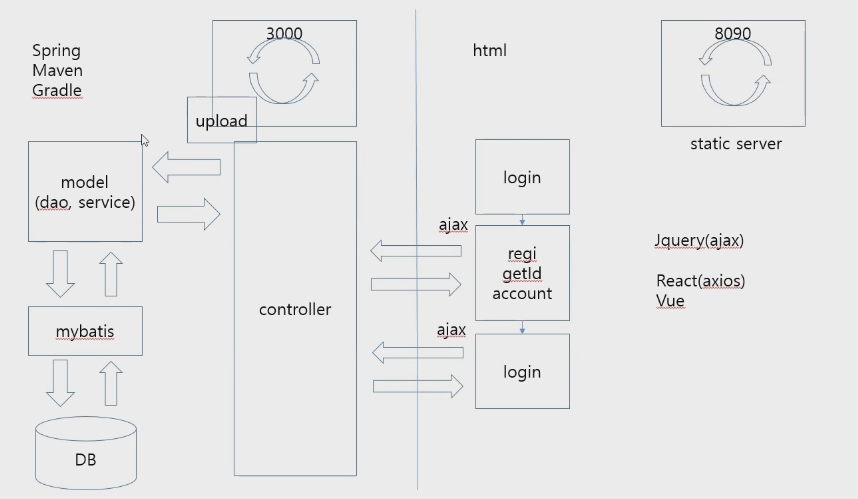

# Sample 1

## Back-End

### 환경 세팅

Maven(프로젝트 생성 - 라이브러리 설정 - 코드 작업 - 컴파일 - 테스트 -패키지 만들기 - 배포 - 레포팅)을 설치해주어 프로젝트 Build를 해준다. 

Maven Repository에서  [Spring Boot Starter Web](https://mvnrepository.com/artifact/org.springframework.boot/spring-boot-starter-web) 3.03 버전 dependency와 

~~~xml
<dependency>
    <groupId>org.springframework.boot</groupId>
    <artifactId>spring-boot-starter-web</artifactId>
    <version>3.0.3</version>
</dependency>
~~~

[Spring Boot Starter Tomcat](https://mvnrepository.com/artifact/org.springframework.boot/spring-boot-starter-tomcat) 3.03버전을 pom.xml에 추가한다.

~~~xml
<dependency>
    <groupId>org.springframework.boot</groupId>
    <artifactId>spring-boot-starter-tomcat</artifactId>
    <version>3.0.3</version>
</dependency>
~~~

### Controller   - RestController

~~~java
package mul.cam.a.controller;

import java.util.ArrayList;
import java.util.Date;
import java.util.List;

import org.springframework.web.bind.annotation.GetMapping;
import org.springframework.web.bind.annotation.PostMapping;
import org.springframework.web.bind.annotation.RequestMapping;
import org.springframework.web.bind.annotation.RequestMethod;
import org.springframework.web.bind.annotation.RestController;

import mul.cam.a.dto.HumanDto;

@RestController		// = @Controller + @Responsebody = @RestController -> 모든 페이지 Ajax를 사용하므로 Responsebody 전체 적용.
public class HelloController {

	@RequestMapping(value = "/", method = RequestMethod.GET)
	public String hello() {
		System.out.println("HelloController hello() " + new Date());
		
		return "hello";
	}
	
	@GetMapping(value = "/test")
	public String test() {
		System.out.println("HelloController test() " + new Date());
		
		return "테스트";
	}
	
	@GetMapping(value = "/human")
	public HumanDto getDto() {
		System.out.println("HelloController getDto() " + new Date());
		
		HumanDto human = new HumanDto(1001, "홍길동", "서울시");
		
		return human;
	}
	
	@GetMapping(value = "/conn_param")
	public String conn_param(String title) {
		// 주소창에 http://localhost:3000/conn_param?title=제목
		System.out.println("HelloController conn_param() " + new Date());
		
		System.out.println("title:" + title);
		
		return "conn success";
	}
	
	@GetMapping(value = "param_obj")
	public String param_obj(HumanDto human) {
		// 주소창에 http://localhost:3000/param_obj?number=1002&name=성춘향&address=남원시
		System.out.println("HelloController param_obj() " + new Date());
		
		System.out.println(human.toString());
		
		return "OK";
	}
	
	@GetMapping("/get_list") // Post는 정보 노출 때문에 접근 거부
	public List<HumanDto> get_list() {
		System.out.println("HelloController get_list() " + new Date());
		
		List<HumanDto> list = new ArrayList<>();
		list.add(new HumanDto(101, "홍길동", "서울시"));
		list.add(new HumanDto(102, "성춘향", "남원시"));
		list.add(new HumanDto(103, "임꺽정", "광주시"));
		
		return list;
		
	}
}
~~~

### dto

~~~java
package mul.cam.a.dto;

public class HumanDto {

	private int number;
	private String name;
	private String address;
	
	public HumanDto() {
	}

	public HumanDto(int number, String name, String address) {
		super();
		this.number = number;
		this.name = name;
		this.address = address;
	}

	public int getNumber() {
		return number;
	}

	public void setNumber(int number) {
		this.number = number;
	}

	public String getName() {
		return name;
	}

	public void setName(String name) {
		this.name = name;
	}

	public String getAddress() {
		return address;
	}

	public void setAddress(String address) {
		this.address = address;
	}

	@Override
	public String toString() {
		return "HumanDto [number=" + number + ", name=" + name + ", address=" + address + "]";
	}
	
}
~~~

### WebConfigurer  :  클라이언트 접속 허가, @Configuration

~~~java
package mul.cam.a;

import org.springframework.context.annotation.Configuration;
import org.springframework.web.servlet.config.annotation.CorsRegistry;
import org.springframework.web.servlet.config.annotation.WebMvcConfigurer;

@Configuration	// 설정 -> 자동 생성, 따로 호출할 필요가 없다.
public class WebConfigurer implements WebMvcConfigurer{

	@Override
	public void addCorsMappings(CorsRegistry registry) {
		
		// 접속 클라이언트를 허가
		registry.addMapping("/**").allowedOrigins("*"); // * : 모든 접속을 허용해주겠다.
		// registry.addMapping("/**").allowedOrigins("http://localhost:8090"); // 허용 클라이언트 설정
		// -> 다른 포트면 접속 불가
	}
	
}
~~~

### application.properties : 서버 포트 설정

~~~properties
# port number setting
server.port=3000
~~~

### pom.xml

~~~xml
<?xml version="1.0" encoding="UTF-8"?>
<project xmlns="http://maven.apache.org/POM/4.0.0" xmlns:xsi="http://www.w3.org/2001/XMLSchema-instance"
	xsi:schemaLocation="http://maven.apache.org/POM/4.0.0 https://maven.apache.org/xsd/maven-4.0.0.xsd">
	<modelVersion>4.0.0</modelVersion>
	<parent>
		<groupId>org.springframework.boot</groupId>
		<artifactId>spring-boot-starter-parent</artifactId>
		<version>3.0.3</version>
		<relativePath/> <!-- lookup parent from repository -->
	</parent>
	<groupId>com.example</groupId>
	<artifactId>sample1</artifactId>
	<version>0.0.1-SNAPSHOT</version>
	<name>sample1</name>
	<description>Demo project for Spring Boot</description>
	<properties>
		<java.version>17</java.version>
	</properties>
	<dependencies>
		<dependency>
			<groupId>org.springframework.boot</groupId>
			<artifactId>spring-boot-starter</artifactId>
		</dependency>

		<dependency>
			<groupId>org.springframework.boot</groupId>
			<artifactId>spring-boot-starter-test</artifactId>
			<scope>test</scope>
		</dependency>
		-------------------------------------------------------여기서부터 추가
		<dependency>
		    <groupId>org.springframework.boot</groupId>
		    <artifactId>spring-boot-starter-web</artifactId>
		</dependency>

		<dependency>
		    <groupId>org.springframework.boot</groupId>
		    <artifactId>spring-boot-starter-tomcat</artifactId>
		</dependency>
		
	</dependencies>

	<build>
		<plugins>
			<plugin>
				<groupId>org.springframework.boot</groupId>
				<artifactId>spring-boot-maven-plugin</artifactId>
			</plugin>
		</plugins>
	</build>

</project>

~~~

## Front-End

### 환경 세팅

우선, Jquery 사용을 하는 프론트엔드를 진행한다. eclipse를 키고, w3schools에서 Jquery script를 가져온다.
~~~html
<!-- Jquery -->

~~~

src - main에 webapp 폴더 생성, 그 안에 WEB-INF 폴더 생성

### index.html

~~~html
<!DOCTYPE html>
<html>
<head>
<meta charset="UTF-8">
<title>Insert title here</title>

<!-- Jquery -->

</head>
<body>

<button type="button" id="btn">hello</button>

  

번호:<h3 id="num"></h3>
이름:<h3 id="name"></h3>
주소:<h3 id="address"></h3>

<button type="button" id="human">human</button>

  

<h3 id="param"></h3>

<button type="button" id="paramBtn">conn param</button>

  

<button type="button" id="listBtn">Get List</button>

</body>
</html>
~~~

### default.html

~~~html
<!DOCTYPE html>
<html>
<head>
<meta charset="UTF-8">
<title>Insert title here</title>
</head>
<body>

<button type="button" onclick="btnClick()">hello</button>

</body>
</html>
~~~

# Sample2 - File

## Back End

### Controller

~~~java
package mul.cam.a.controller;

import java.io.BufferedOutputStream;
import java.io.File;
import java.io.FileInputStream;
import java.io.FileOutputStream;
import java.util.Date;

import org.springframework.beans.factory.annotation.Autowired;
import org.springframework.core.io.InputStreamResource;
import org.springframework.http.HttpHeaders;
import org.springframework.http.MediaType;
import org.springframework.http.ResponseEntity;
import org.springframework.web.bind.annotation.RequestMapping;
import org.springframework.web.bind.annotation.RequestMethod;
import org.springframework.web.bind.annotation.RequestParam;
import org.springframework.web.bind.annotation.RestController;
import org.springframework.web.multipart.MultipartFile;

import jakarta.servlet.ServletContext;
import jakarta.servlet.http.HttpServletRequest;
import mul.cam.a.MediaTypeUtiles;
import mul.cam.a.dto.HumanDto;

@RestController
public class HelloController {

	// upload
	@RequestMapping(value = "/fileUpload", method = RequestMethod.POST)
	public String fileUpload(HumanDto human,
							@RequestParam("uploadFile")MultipartFile uploadFile,
							HttpServletRequest req) { // req -> 경로 얻기 
		System.out.println("HelloController fileUpload " + new Date());
		System.out.println(human.toString());
		
		// 경로
		// 실제 서버에 올릴 때
		String path = req.getServletContext().getRealPath("/upload");
		// 클라이언트에 올릴 때, 연습할 때
		// String path = "c:\temp";
		
		String filename = uploadFile.getOriginalFilename();
		String filepath = path + "/" + filename;
		
		System.out.println(filepath);
		
		File file  = new File(filepath);
		
		try {
			BufferedOutputStream bos = new BufferedOutputStream(new FileOutputStream(file));
			bos.write(uploadFile.getBytes());
			bos.close();
			
		} catch (Exception e) {
			return "file upload fail";
		} 
		
		return "file upload success";
	}
	
	
	
	// download
	@Autowired
	ServletContext servletContext;
	
	@RequestMapping(value = "/fileDownload")
	public ResponseEntity<InputStreamResource> download(String filename, HttpServletRequest req) throws Exception {
		System.out.println("HelloController download " + new Date());
		
		// 경로
		String path = req.getServletContext().getRealPath("/upload");
		// String path = "c:\temp";
		
		MediaType mediaType = MediaTypeUtiles.getMediaTypeForFileName(this.servletContext, filename);
		System.out.println("filename:" + filename);
		System.out.println("mediaType:" + mediaType);
		
		File file = new File(path + File.separator + filename);		// File.separator = '/', new 파일 명
		
		InputStreamResource isr = new InputStreamResource(new FileInputStream(file));
		
		// db 다운로드 카운트
		return ResponseEntity.ok()
					.header(HttpHeaders.CONTENT_DISPOSITION, "attachment;filename=" + file.getName()) // 원본파일명
					.contentType(mediaType)
					.contentLength(file.length())
					.body(isr);					
	}
}
~~~

### dto

~~~java
package mul.cam.a.dto;

public class HumanDto {

	private int number;
	private String name;
	private String address;
	
	public HumanDto() {
	}

	public HumanDto(int number, String name, String address) {
		super();
		this.number = number;
		this.name = name;
		this.address = address;
	}

	public int getNumber() {
		return number;
	}

	public void setNumber(int number) {
		this.number = number;
	}

	public String getName() {
		return name;
	}

	public void setName(String name) {
		this.name = name;
	}

	public String getAddress() {
		return address;
	}

	public void setAddress(String address) {
		this.address = address;
	}

	@Override
	public String toString() {
		return "HumanDto [number=" + number + ", name=" + name + ", address=" + address + "]";
	}
	
	
}
~~~

### MediaTypeUtiles

~~~java
package mul.cam.a;

import org.springframework.http.MediaType;

import jakarta.servlet.ServletContext;

public class MediaTypeUtiles {
	
	public static MediaType getMediaTypeForFileName(ServletContext servletContext, String filename) {
		
		String mimType = servletContext.getMimeType(filename);
		
		try {
			MediaType mediaType = MediaType.parseMediaType(mimType);			
			return mediaType;
		}catch (Exception e) {
			return MediaType.APPLICATION_OCTET_STREAM;
		}		
	}

}
~~~

## Front End

### index.html

~~~html
<!DOCTYPE html>
<html>
<head>
<meta charset="UTF-8">
<title>Insert title here</title>

</head>
<body>

<h3>file upload</h3>

...

<form id="uploadFileForm">
	number:<input type="text" name="number" value="1002"> 
	name:<input type="text" name="name" value="성춘향"> 
	address:<input type="text" name="address" value="남원시">  
	
	file:<input type="file" name="uploadFile">  
	
	<button type="button" id="uploadBtn">파일 업로드</button>
</form>

  

<h3>file download</h3>

<button type="button" id="downloadBtn">파일 다운로드</button>

</body>
</html>
~~~

 # sample3 - DB

## 환경 세팅

Maven Repository에서 [Jackson Core](https://mvnrepository.com/artifact/com.fasterxml.jackson.core/jackson-core) » [2.14.1](https://mvnrepository.com/artifact/com.fasterxml.jackson.core/jackson-core/2.14.1) pom.xml에 추가

~~~xml
<!-- https://mvnrepository.com/artifact/com.fasterxml.jackson.core/jackson-core -->
<dependency>
    <groupId>com.fasterxml.jackson.core</groupId>
    <artifactId>jackson-core</artifactId>
    <version>2.14.1</version>
</dependency>
~~~

[
Jackson Databind](https://mvnrepository.com/artifact/com.fasterxml.jackson.core/jackson-databind) **»** [2.14.1](https://mvnrepository.com/artifact/com.fasterxml.jackson.core/jackson-databind/2.14.1) pom에 추가

~~~xml
<!-- https://mvnrepository.com/artifact/com.fasterxml.jackson.core/jackson-databind -->
<dependency>
    <groupId>com.fasterxml.jackson.core</groupId>
    <artifactId>jackson-databind</artifactId>
    <version>2.14.1</version>
</dependency>
~~~

[Spring Boot Starter JDBC](https://mvnrepository.com/artifact/org.springframework.boot/spring-boot-starter-jdbc) » [3.0.3](https://mvnrepository.com/artifact/org.springframework.boot/spring-boot-starter-jdbc/3.0.3)pom에 추가

~~~xml
<!-- https://mvnrepository.com/artifact/org.springframework.boot/spring-boot-starter-jdbc -->
<dependency>
    <groupId>org.springframework.boot</groupId>
    <artifactId>spring-boot-starter-jdbc</artifactId>
    <version>3.0.3</version>
</dependency>
~~~

[
MyBatis Spring](https://mvnrepository.com/artifact/org.mybatis/mybatis-spring) **»** [3.0.1](https://mvnrepository.com/artifact/org.mybatis/mybatis-spring/3.0.1) 추가

~~~xml
<!-- https://mvnrepository.com/artifact/org.mybatis/mybatis-spring -->
<dependency>
    <groupId>org.mybatis</groupId>
    <artifactId>mybatis-spring</artifactId>
    <version>3.0.1</version>
</dependency>
~~~

[
MyBatis Spring Boot Starter](https://mvnrepository.com/artifact/org.mybatis.spring.boot/mybatis-spring-boot-starter) **»** [3.0.1](https://mvnrepository.com/artifact/org.mybatis.spring.boot/mybatis-spring-boot-starter/3.0.1) 추가

~~~xml
<!-- https://mvnrepository.com/artifact/org.mybatis.spring.boot/mybatis-spring-boot-starter -->
<dependency>
    <groupId>org.mybatis.spring.boot</groupId>
    <artifactId>mybatis-spring-boot-starter</artifactId>
    <version>3.0.1</version>
</dependency>
~~~

[MyBatis](https://mvnrepository.com/artifact/org.mybatis/mybatis) » [3.5.11](https://mvnrepository.com/artifact/org.mybatis/mybatis/3.5.11) 추가

~~~xml
<!-- https://mvnrepository.com/artifact/org.mybatis/mybatis -->
<dependency>
    <groupId>org.mybatis</groupId>
    <artifactId>mybatis</artifactId>
    <version>3.5.11</version>
</dependency>
~~~

[MySQL Connector Java](https://mvnrepository.com/artifact/mysql/mysql-connector-java) » [8.0.29](https://mvnrepository.com/artifact/mysql/mysql-connector-java/8.0.29) 추가

~~~xml
<!-- https://mvnrepository.com/artifact/mysql/mysql-connector-java -->
<dependency>
    <groupId>mysql</groupId>
    <artifactId>mysql-connector-java</artifactId>
    <version>8.0.29</version>
</dependency>
~~~

## db 설정

~~~properties

server.port=3000

spring.datasource.hikari.driver-class-name=com.mysql.cj.jdbc.Driver
spring.datasource.hikari.jdbc-url=jdbc:mysql://localhost:3306/mydb?serverTimeZone=Asia/Seoul
spring.datasource.hikari.username=root
spring.datasource.hikari.password=1234
~~~

- serverTimeZone=Asia/Seoul : 속도를 빠르게 하기 위해 추가.

### Controller

~~~java
package mul.cam.a.controller;

import java.util.Date;
import java.util.List;

import org.springframework.beans.factory.annotation.Autowired;
import org.springframework.web.bind.annotation.GetMapping;
import org.springframework.web.bind.annotation.RestController;

import mul.cam.a.dto.MemberDto;
import mul.cam.a.service.MemberService;

@RestController
public class MemberController {

	@Autowired // @Autowired란 스프링 컨테이너에 등록한 빈에게 의존관계주입이 필요할 때, DI(의존성 주입)을 도와주는 어노테이션이다.
	MemberService service;
	
	@GetMapping(value = "/allList")
	public List<MemberDto> allList(){
		System.out.println("MemberController allList" + new Date());
		return service.allMember();	// List로 return
	}
}
~~~

## Service

~~~java
package mul.cam.a.service;

import java.util.List;

import org.springframework.beans.factory.annotation.Autowired;
import org.springframework.stereotype.Service;
import org.springframework.transaction.annotation.Transactional;

import mul.cam.a.dao.MemberDao;
import mul.cam.a.dto.MemberDto;

@Service
@Transactional
public class MemberService {
	
	@Autowired	// 인터페이스 자동 생성.
	MemberDao dao;	
	
	public List<MemberDto> allMember() { // 여기는 이름 막 지어도 됨
		return dao.allMember();
		
	}

}
~~~

## Dao

~~~java
package mul.cam.a.dao;

import java.util.List;

import org.apache.ibatis.annotations.Mapper;
import org.springframework.stereotype.Repository;

import mul.cam.a.dto.MemberDto;

@Mapper	// boot 오면서 추가
@Repository
public interface MemberDao {

	List<MemberDto> allMember(); // xml 아이디와 동일해야만 함.
}
~~~

##  Member.xml

~~~xml
<?xml version="1.0" encoding="UTF-8"?>
<!DOCTYPE mapper PUBLIC "-//mybatis.org//DTD Mapper 3.0//EN"
	"http://mybatis.org/dtd/mybatis-3-mapper.dtd">

<mapper namespace="mul.cam.a.dao.MemberDao">

<select id="allMember" resultType="mul.cam.a.dto.MemberDto">
	select id, pwd, name, email, auth
	from member
</select>

</mapper>
~~~

## DatabaseConfig : properties 설정

~~~java
package mul.cam.a;

import javax.sql.DataSource;

import org.apache.ibatis.session.SqlSessionFactory;
import org.mybatis.spring.SqlSessionFactoryBean;
import org.mybatis.spring.SqlSessionTemplate;
import org.springframework.boot.context.properties.ConfigurationProperties;
import org.springframework.context.annotation.Bean;
import org.springframework.context.annotation.Configuration;
import org.springframework.context.annotation.PropertySource;
import org.springframework.core.io.Resource;
import org.springframework.core.io.support.PathMatchingResourcePatternResolver;

import com.zaxxer.hikari.HikariConfig;
import com.zaxxer.hikari.HikariDataSource;

@Configuration // 자동 설정
@PropertySource("classpath:/application.properties")	// application.properties에 있는 소스를 불러 와라.
public class DatabaseConfig {

	@Bean	// 객체 자동 생성
	@ConfigurationProperties(prefix = "spring.datasource.hikari")
	public HikariConfig hikariConfig() {
		return new HikariConfig();
	}

	@Bean
	public DataSource dataSource() {
			DataSource dataSource = new HikariDataSource(hikariConfig());
			System.out.println("dataSource:" + dataSource);
			return dataSource;
	}
	
	@Bean
	public SqlSessionFactory sqlSessionFactory(DataSource dataSource) throws Exception{
		System.out.println("DatabaseConfig sqlSessionFactory");
		
		SqlSessionFactoryBean sqlSessionFactoryBean = new SqlSessionFactoryBean();
		sqlSessionFactoryBean.setDataSource(dataSource);
		
		Resource[] arrResource = new PathMatchingResourcePatternResolver().getResources("classpath:sqls/*.xml");
		sqlSessionFactoryBean.setMapperLocations(arrResource);
		sqlSessionFactoryBean.getObject().getConfiguration().setMapUnderscoreToCamelCase(true);

		return (SqlSessionFactory)sqlSessionFactoryBean.getObject();
	}
	
	@Bean
	public SqlSessionTemplate sqlSession(SqlSessionFactory sqlSessionFactory) {
		return new SqlSessionTemplate(sqlSessionFactory);
	}
}
~~~

