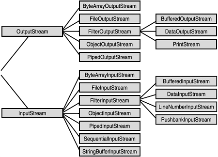

## 자바 파일 I/O

자바에서 입출력을 수행하려면 두 노드(키보드, 모니터, 메모리, 파일 등)사이를 연결하려는 무언인가가 필요하고 이를 스트림(stream) 이라고 합니다.

자바에서 **데이터를 운반하는 연결 통로** 역할을 **스트림(STREAM)**이 수행합니다.
스트림은 단방향으로 통신이 가능하며 하나의 스트림으로 입출력을 같이 처리할 수 없습니다.
따라서, **입력 스트림**과 **출력 스트림**이 모두 필요합니다.

이때 스트림이 처리하는 데이터 타입에 따라 **바이트 기반(XXXStream)** 과 **캐릭터 기반 스트림(XXXer)** 으로 나뉘어집니다.